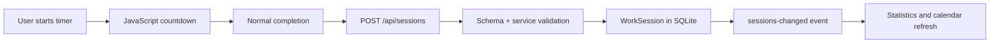
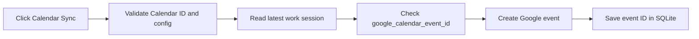
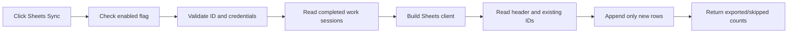

# Захист проєкту Pomodoro Work Tracker

Цей документ пояснює фактичну реалізацію проєкту станом на 15 липня 2026 року.
Він призначений для підготовки до захисту: що робить застосунок, як пов’язані
frontend, Flask і SQLite, яку роль виконує кожен важливий клас або метод і як
показати роботу проєкту викладачеві без розкриття Google credentials.

## 1. Ідея та призначення

Pomodoro — це техніка керування часом: користувач працює сфокусований інтервал,
після нього робить коротку перерву, а після кількох циклів — довгу. Застосунок
вирішує практичну проблему: не лише відраховує час, а й зберігає завершені
інтервали, щоб користувач бачив реальну історію роботи та відпочинку.

Основний сценарій:

```text
Користувач відкриває застосунок
→ налаштовує тривалість і timezone
→ запускає focus або break
→ за потреби ставить на паузу чи пропускає інтервал
→ нормально завершує інтервал
→ JavaScript надсилає завершену сесію у Flask API
→ Flask перевіряє дані та записує WorkSession у SQLite
→ статистика й календар активності читають цей запис
→ користувач може завантажити CSV
→ за бажанням вручну синхронізує focus із Calendar або Sheets
```

Чому обрано цей стек:

- **Flask** дає невелике й зрозуміле ядро, application factory, Blueprints і
  можливість окремо показати маршрути, сервіси та тести.
- **SQLite** не потребує окремого сервера, тому підходить для локального
  однокористувацького навчального проєкту.
- **SQLAlchemy і Flask-Migrate** відокремлюють Python-моделі від SQL-команд і
  дозволяють версіонувати схему БД.
- **Jinja2 і Bootstrap 5.3** формують адаптивний HTML без окремого SPA-фреймворку.
- **Vanilla JavaScript** виконує countdown у браузері, де він безпосередньо
  оновлює екран і реагує на кнопки.
- **Google Calendar і Google Sheets** залишаються опціональними: базовий
  Pomodoro, SQLite, статистика, календар активності та CSV працюють без них.

Це portfolio/educational application, а не готова багатокористувацька production
система. Така межа є свідомою й пояснюється в розділі з обмеженнями.

## 2. Логічний процес створення проєкту

Git-історія не використовується як доказ точного хронологічного порядку. Нижче
наведено логічну послідовність, яка відповідає поточним залежностям коду.

1. Створити Python-проєкт і `run.py` як мінімальну точку входу.
2. Перенести створення Flask object у `create_app()`.
3. Описати `BaseConfig`, `DevelopmentConfig`, `TestingConfig` і
   `ProductionConfig` у `app/config.py`.
4. Додати `.env.example` і завантаження `.env` через `load_dotenv()`.
5. Створити порожні extension objects `db`, `migrate`, `api` у
   `app/extensions.py`, а ініціалізувати їх уже всередині factory.
6. Описати моделі `WorkSession` і `UserSettings`.
7. Створити Alembic migrations для таблиць і наступних полів.
8. Розділити сторінки й API на Blueprints.
9. Додати Marshmallow schemas для request validation і response serialization.
10. Винести SQLAlchemy-запити в repositories.
11. Винести правила збереження, статистики, календаря та експорту в services.
12. Створити Jinja templates і підключити Bootstrap/CSS.
13. Реалізувати браузерний timer у `app/static/js/timer.js`.
14. Після нормального завершення надсилати `POST /api/sessions`.
15. Побудувати статистику дня, тижня, місяця й 7-денний Chart.js графік.
16. Побудувати локальний календар активності на основі SQLite.
17. Додати CSV export.
18. Додати ручну синхронізацію останнього focus у Google Calendar.
19. Додати незалежний опціональний експорт завершених focus у Google Sheets.
20. Покрити доменну логіку, API та frontend contracts тестами.
21. Додати Dockerfile, `start.sh` і Gunicorn для повторюваного запуску.
22. Узгодити README, робочі журнали та цей документ із перевіреним кодом.

## 3. Архітектура та application factory

### 3.1 Точка входу

`run.py` імпортує `create_app`, створює `app` і при прямому запуску виконує
`app.run()`. Локальна команда:

```powershell
python run.py
```

У Docker застосунок запускається не development server, а Gunicorn:

```text
gunicorn "app:create_app()"
```

### 3.2 Що робить `create_app()`

Функція `create_app(config_name=None)` у `app/__init__.py` послідовно:

1. викликає `load_dotenv()`;
2. створює `Flask(__name__)`;
3. вибирає config class через `get_config_class()`;
4. переносить runtime environment values у `app.config`;
5. перетворює локальний relative SQLite URL на абсолютний шлях усередині
   `instance/`;
6. налаштовує logging;
7. викликає `init_app()` для SQLAlchemy, Migrate і Flask-Smorest;
8. реєструє page/API Blueprints;
9. реєструє єдині error handlers і CLI commands;
10. для локального SQLite створює `instance/`, застосовує migrations і гарантує
    наявність одного `UserSettings` row.

Перевага factory pattern: тест може викликати `create_app("testing")`, отримати
окрему конфігурацію й тимчасову SQLite, не запускаючи реальний сервер і не
змішуючи тестовий стан із локальною БД користувача.

### 3.3 Середовища

- `development`: debug читається з `DEBUG`; локальний запуск найзручніший.
- `testing`: `TESTING=True`, in-memory/default test SQLite, короткий test mode;
  pytest fixture додатково задає окремий temporary database file.
- `production`: debug вимкнений, test mode вимкнений; у контейнері Gunicorn
  слухає `${PORT:-5000}`.

Google Sheets не перевіряється в `create_app()`. Відсутні ID або credentials не
можуть зупинити startup, якщо інтеграція вимкнена.

## 4. Конфігурація та environment variables

`.env.example` містить лише безпечні приклади. Реальний `.env` і JSON keys не
можна комітити, показувати в скриншотах або вставляти в документацію.
`load_dotenv()` за замовчуванням не перезаписує змінну, яка вже задана в
PowerShell, тому значення поточної shell session має пріоритет над `.env`.

| Variable | Обов’язкова | Default | Призначення | Коли перевіряється |
| --- | ---: | --- | --- | --- |
| `FLASK_APP` | лише для Flask CLI | `run.py` у `.env.example` | точка входу для `flask ...` | Flask CLI |
| `APP_ENV` | ні | `development` | вибір config class | startup |
| `SECRET_KEY` | для production так | development fallback | Flask secret configuration | startup; fallback не підходить production |
| `DEBUG` | ні | `true` у development | development debug | startup у development |
| `PORT` | для custom container port | `5000` | порт у `start.sh`; `python run.py` використовує стандартний Flask port | запуск контейнера |
| `DATABASE_URL` | ні | `sqlite:///pomodoro.db` | SQLAlchemy database URI | startup |
| `DEFAULT_TIMEZONE` | ні | `Europe/Kyiv` | timezone першого settings row | створення settings |
| `DEFAULT_CYCLES_BEFORE_LONG_BREAK` | ні | `4` | початковий long-break interval | startup/створення settings |
| `POMODORO_TEST_MODE` | ні | `false` | дозволяє preset 10 s / 5 s | startup |
| `GOOGLE_CALENDAR_ID` | лише для Calendar sync | blank | ID календаря, не embed URL | status/sync |
| `GOOGLE_CALENDAR_CREDENTIALS_JSON` | лише для Calendar sync | blank | one-line service-account JSON | Calendar client creation |
| `GOOGLE_CALENDAR_EVENT_PREFIX` | ні | `Pomodoro` | початок event summary | Calendar payload creation |
| `GOOGLE_CALENDAR_EVENT_COLOR_ID` | ні | blank | optional Google event color | Calendar payload creation |
| `GOOGLE_SHEETS_ENABLED` | ні | `false` | feature flag Sheets | settings/status/sync, не startup validation |
| `GOOGLE_SHEETS_SPREADSHEET_ID` | лише коли Sheets enabled | blank | ID між `/d/` і `/edit` | enabled settings save/sync |
| `GOOGLE_SHEETS_CREDENTIALS_JSON` | лише коли Sheets enabled | blank | one-line service-account JSON | enabled status/save/sync |

`_get_env_bool()` вважає true значення `1`, `true`, `yes`, `on` незалежно від
регістру. Інші значення трактуються як false. `_get_env_int()` повертає default,
якщо ціле число прочитати неможливо.

Після зміни `.env` Flask треба перезапустити: config завантажується під час
створення application object, а не перечитується на кожний request.

## 5. База даних і migrations

### 5.1 Розташування SQLite

Relative URI `sqlite:///pomodoro.db` перетворюється на абсолютній шлях:

```text
instance/pomodoro.db
```

Папка `instance/` призначена для runtime data. База не видаляється під час
звичайного запуску або migration upgrade.

### 5.2 `WorkSession` → таблиця `work_sessions`

| Поле | Required | Що зберігає |
| --- | ---: | --- |
| `id` | так | integer primary key SQLite |
| `client_session_id` | так, unique | стабільний UUID/ID, створений браузером; захист від повторного POST і Sheets duplicate |
| `mode` | так | `work`, `short_break` або `long_break` |
| `planned_duration_seconds` | так | запланована тривалість |
| `actual_duration_seconds` | так | фактично зарахована тривалість завершеної сесії |
| `started_at_utc` | так | початок у UTC |
| `completed_at_utc` | так | завершення у UTC |
| `google_calendar_event_id` | ні, unique | ID створеної Calendar event; duplicate marker |
| `created_at_utc` | так | час створення DB row |

Таблиця містить лише завершені сесії. `SessionCreateSchema` вимагає обидва
timestamps і позитивні durations, а `SessionService` додатково перевіряє, що
completion пізніше start. `Reset` і `Skip` не викликають save API, тому
незавершеного row немає ні в статистиці, ні в Sheets export.

### 5.3 `UserSettings` → таблиця `user_settings`

| Поле | Що зберігає |
| --- | --- |
| `id` | singleton row, фактично `1` |
| `work_duration_minutes` | тривалість focus |
| `short_break_minutes` | коротка перерва |
| `long_break_minutes` | довга перерва |
| `cycles_before_long_break` | після скількох focus cycles потрібна long break |
| `sound_enabled` | звукове повідомлення після completion |
| `auto_start_next_session` | automatic start наступного режиму після normal completion |
| `theme` | `light`, `dark` або `system` |
| `timezone` | IANA timezone, наприклад `Europe/Kyiv` |
| `google_sheets_enabled` | nullable safe Sheets override |
| `google_sheets_spreadsheet_id` | nullable safe ID override |
| `updated_at_utc` | час останнього оновлення |

Nullable Sheets fields потрібні для м’якого переходу: `NULL` означає «ще не
збережено через UI, використати env fallback». Після `Save Settings` браузерні
safe values зберігаються в SQLite; credentials ніколи не потрапляють у таблицю.

### 5.4 Migrations

Послідовність migrations створює базові таблиці, додає timer cycle settings,
Calendar event ID і nullable Sheets settings. `flask --app run.py db upgrade`
застосовує лише відсутні revisions. Не слід вручну редагувати вже застосовану
migration або видаляти користувацьку БД для звичайного upgrade.

## 6. Blueprints, routes і endpoints

Flask `Blueprint` групує пов’язані маршрути. API Blueprints використовують
Flask-Smorest, `MethodView` і schemas: decorator `arguments(...)` десеріалізує та
перевіряє request, а `response(...)` формує задокументований JSON response.

| Method | URL | Function/class | Призначення | Request | Основна відповідь |
| --- | --- | --- | --- | --- | --- |
| GET | `/` | `pages.index` | головна сторінка | — | Jinja HTML |
| GET | `/statistics` | `pages.statistics_page` | сторінка статистики | — | Jinja HTML |
| GET | `/calendar` | `pages.calendar_page` | календар активності | — | Jinja HTML |
| GET | `/api/health` | `HealthResource.get` | health check | — | status/service/environment |
| POST | `/api/sessions` | `SessionCollectionResource.post` | зберегти completed session | `SessionCreateSchema` JSON | `201 SessionSchema` |
| GET | `/api/sessions` | `SessionCollectionResource.get` | список/фільтр сесій | mode/date/timezone query | list + total |
| GET | `/api/sessions/<id>` | `SessionResource.get` | одна сесія | path ID | session JSON |
| DELETE | `/api/sessions/<id>` | `SessionResource.delete` | видалити row | path ID | message |
| GET | `/api/settings` | `SettingsResource.get` | поточні timer settings | — | `SettingsSchema` |
| PUT | `/api/settings` | `SettingsResource.put` | зберегти timer settings | `SettingsUpdateSchema` | updated settings |
| GET | `/api/statistics/today` | `TodayStatisticsResource.get` | summary дня | optional timezone | focus/break/total minutes |
| GET | `/api/statistics/week` | `WeekStatisticsResource.get` | summary календарного тижня | optional timezone | summary |
| GET | `/api/statistics/month` | `MonthStatisticsResource.get` | summary місяця | optional timezone | summary |
| GET | `/api/statistics/chart` | `ChartStatisticsResource.get` | останні 7 днів | optional timezone | chart points |
| GET | `/api/calendar/month` | `CalendarMonthResource.get` | activity days | year/month/timezone | days array |
| GET | `/api/calendar/day` | `CalendarDayResource.get` | detail selected date | date/timezone | sessions + summary |
| GET | `/api/export/sessions.csv` | `SessionExportResource.get` | CSV download | optional date range/timezone | `text/csv` |
| GET | `/api/integrations/google-calendar/status` | `GoogleCalendarStatusResource.get` | Calendar readiness | — | safe status |
| POST | `/api/integrations/google-calendar/sync` | `GoogleCalendarSyncResource.post` | latest work → event | optional timezone JSON | event/session IDs |
| GET | `/api/integrations/google-sheets/settings` | `GoogleSheetsSettingsResource.get` | safe settings/readiness | — | no credential contents |
| PUT | `/api/integrations/google-sheets/settings` | `GoogleSheetsSettingsResource.put` | validate/save enabled + ID | enabled + Spreadsheet ID | safe settings |
| POST | `/api/integrations/google-sheets/sync` | `GoogleSheetsSyncResource.post` | append new work rows | empty JSON accepted | counts + message |
| GET | `/api/docs` | generated by Flask-Smorest | development Swagger UI | — | HTML |

### 6.1 Ланцюг важливого request

Наприклад, `POST /api/sessions`:

```text
timer.js saveCompletedSession()
→ SessionCreateSchema
→ SessionCollectionResource.post()
→ SessionService.create_session()
→ SessionRepository
→ WorkSession + db.session.commit()
→ SessionSchema JSON
→ pomodoro:sessions-changed browser event
```

Route class залишається тонким: він не дублює validation і SQLAlchemy queries.

## 7. Services і їхня роль

### 7.1 `SettingsService`

- `get_settings()` читає singleton через `SettingsRepository`; якщо row немає,
  створює defaults.
- `get_settings_payload()` повертає serialized safe values.
- `update_settings(payload)` перевіряє allowed values, timezone, змінює model і
  commit-ить transaction.
- `_validate_payload(payload)` перевіряє themes, IANA timezone, дозволені
  durations і межі cycles.

### 7.2 `SessionService`

- `create_session(payload)` переводить timestamps у storage UTC, перевіряє mode,
  durations, chronological order і duplicate `client_session_id`, потім створює
  `WorkSession`.
- `list_sessions(query_args)` застосовує mode/date filters через repository.
- `get_session(id)` і `delete_session(id)` працюють з одним row.
- `serialize(session)` формує public JSON із UTC ISO 8601 timestamps.

### 7.3 `StatisticsService`

- `get_today_summary`, `get_week_summary`, `get_month_summary` визначають local
  date range і делегують `_build_summary`.
- `_build_summary` переводить local boundaries у UTC, читає rows і окремо сумує
  `work` та break seconds.
- `get_chart_data` повертає сім точок із focus minutes і кількістю work sessions.

### 7.4 `CalendarService`

Це **локальний activity calendar**, не Google Calendar. `get_month_summary`
групує completed rows за local date. `get_day_details` повертає local start/end і
список режимів для вибраного дня.

### 7.5 `CSVExportService`

`build_csv(sessions, timezone_name)` записує header і rows у `io.StringIO`.
Start/end конвертуються з UTC у вибрану timezone; БД не змінюється.

### 7.6 `PomodoroTimerService`

Python `PomodoroTimerService` і `TimerState` описують та unit-testять доменні
переходи start/pause/resume/reset/complete. Поточний інтерактивний countdown
виконується у `timer.js`; Python service не є server background timer і не
створює thread.

### 7.7 Навіщо service layer

Routes відповідають за HTTP contract, repositories — за DB queries, services —
за правила. Тому правила можна тестувати через Flask test client або напряму,
а Google client повністю замінити fake object без реального API request.

## 8. Repository layer

`SessionRepository` ізолює `select(WorkSession)`:

- `add`, `delete` — staging model у SQLAlchemy session;
- `get_by_client_session_id` — local duplicate check;
- `get_by_id` — primary key lookup;
- `list_sessions` — mode/date filters і order by completion descending;
- `get_completed_between` — reuse range query;
- `get_latest_work_session` — остання completed `work` для Calendar.

`SettingsRepository` має `get_settings()` і `save(settings)` для singleton row.
Google Sheets використовує наявний `SessionRepository.list_sessions(mode="work")`;
новий repository заради інтеграції не створювався.

## 9. Schemas, validation і помилки

`SessionCreateSchema` вимагає:

- `client_session_id` довжиною 8–64;
- один із трьох modes;
- positive durations до 43 200 seconds;
- timezone-aware start/completion datetimes.

`SettingsUpdateSchema` дозволяє work `15/25/30/45/60`, breaks `5/10/15`, cycles
`2..12`, known theme і string timezone. `SettingsService` додатково перевіряє
timezone через `zoneinfo.ZoneInfo`.

Project-level errors:

- `ValidationAppError` → HTTP 400;
- `NotFoundAppError` → HTTP 404;
- `ConflictAppError` → HTTP 409.

Єдиний handler повертає:

```json
{
  "error": {
    "code": "validation_error",
    "message": "Safe message",
    "details": {}
  }
}
```

Raw Google exception, private key і credentials JSON у response не додаються.
У logging записуються лише безпечні context values на кшталт exception type і
HTTP status, а не exception text із потенційними приватними даними.

## 10. Timer: frontend і backend

### 10.1 Чому countdown у JavaScript

Браузер уже має event loop, `setInterval`, DOM і user events. Python thread для
кожного відкритого timer був би складнішим, вимагав би server-side active state
і не був би потрібний однокористувацькому застосунку.

`timer.js` зберігає active state у `localStorage`: mode, status, planned/remaining
seconds, expected end, cycle count, preset і `clientSessionId`. При refresh
`restoreState()` обчислює remaining time за absolute `expectedEndAtUtc`, тому
просте перезавантаження сторінки не починає інтервал спочатку.

### 10.2 Логіка кнопок timer

| Кнопка | JavaScript function | Що змінює | Чи створює DB row |
| --- | --- | --- | ---: |
| `Start` | `startTimer()` | новий ID, start/end, status running | ні |
| `Pause` | `pauseTimer()` | фіксує remaining, status paused | ні |
| `Resume` | `resumeTimer()` | новий expected end, status running | ні |
| `Reset` | `resetTimer()` | повертає current mode в idle | ні |
| `Skip` | `skipTimer()` | відкидає поточний інтервал і відразу запускає next mode | ні |
| normal completion | `completeTimer()` | status completed, викликає save | так |

`work → short_break`; break → `work`; після configured number of cycles normal
completion веде до `long_break`. Пропущений work не збільшує completed cycle
count. Нормально завершені `work`, `short_break`, `long_break` зберігаються й
додаються відповідно до focus або break statistics.

`saveCompletedSession()` надсилає timestamps і stable `client_session_id`.
Якщо browser повторить POST після refresh, SQLite unique constraint і
`ConflictAppError` не дозволять дублювати row; JavaScript трактує 409 як «already
saved».

### 10.3 Test mode

`POMODORO_TEST_MODE=true` дозволяє browser preset 10 seconds work / 5 seconds
break. Це лише швидкий спосіб дочекатися **нормального completion**. Такі rows
мають ту саму структуру, що й 25-хвилинні.

## 11. Налаштування, статистика, activity calendar і CSV

### 11.1 Загальна кнопка `Save Settings`

`settings.js` перехоплює submit через `onSubmit()`, збирає durations, cycles,
theme, timezone, sound та auto-start і викликає `SettingsStore.saveSettings()` →
`PUT /api/settings`. Після success:

- `UserSettings` оновлюється в SQLite;
- форма отримує normalized server response;
- theme зберігається також у browser localStorage;
- event `pomodoro:settings-updated` оновлює timer/statistics/calendar.

Ця кнопка не має стосунку до Google buttons і не запускає sync.

### 11.2 Статистика

```text
SQLite WorkSession rows
→ SessionRepository range query
→ StatisticsService
→ /api/statistics/* JSON
→ statistics.js
→ cards + Chart.js
```

Local day boundaries створюються у selected IANA timezone, потім переводяться в
UTC для SQL query. Це не дає сесіям біля півночі потрапити в неправильний день.
Focus minutes — лише `mode == "work"`; break minutes — `short_break` плюс
`long_break`; total — сума обох.

### 11.3 Activity calendar

Сторінка `/calendar` не надсилає дані в Google. `calendar.js` викликає
`/api/calendar/month`, малює days і після click викликає `/api/calendar/day`.
Previous/Next змінюють visible month, а day details показують local timestamps.

### 11.4 CSV

`Export CSV` відкриває `/api/export/sessions.csv`. Endpoint читає всі rows або
вибраний date range, конвертує час у requested/settings timezone і повертає файл
`pomodoro-sessions.csv`. Це read-only operation.

## 12. Google Calendar

### 12.1 Призначення та обов’язкові значення

Calendar integration опціональна, але окремого `GOOGLE_CALENDAR_ENABLED` у
проєкті немає. Готовність визначається наявністю:

- `GOOGLE_CALENDAR_ID` — саме ID із **Settings and sharing → Integrate
  calendar**, не URL `https://calendar.google.com/calendar/embed?...`;
- `GOOGLE_CALENDAR_CREDENTIALS_JSON` — повний one-line service-account JSON;
- permission для `client_email` змінювати events у цьому календарі.

`GOOGLE_CALENDAR_EVENT_PREFIX` і color ID необов’язкові.

### 12.2 Методи `GoogleCalendarService`

| Method | Вхід | Результат/побічний ефект |
| --- | --- | --- |
| `get_status()` | — | safe readiness, ID validity, latest work ID і sync marker |
| `sync_latest_work_session(timezone_name)` | optional timezone | створює event, записує `google_calendar_event_id`, повертає IDs/link |
| `_build_event_payload(session, timezone)` | model + IANA timezone | summary, description, local start/end, optional color |
| `_build_calendar_service()` | server config | parsed credentials → Google Calendar v3 client |
| `_is_calendar_id_valid(value)` | config value | відкидає blank, URL і whitespace value до Google request |

`sync_latest_work_session` бере тільки latest `work`. Break rows не стають
events. Якщо `google_calendar_event_id` уже є, повертається 409 Conflict. Calendar
client не викликає жодного Sheets method.

### 12.3 Кнопка `Sync to Google Calendar`

Frontend function `syncGoogleCalendar()` викликає тільки Calendar endpoint.
Кнопка disabled, доки:

1. ID і credentials не присутні;
2. ID схожий на URL замість Calendar ID;
3. ще немає completed work;
4. latest work уже synced.

Після success треба відкрити shared Google Calendar і знайти event
`Pomodoro focus session` у час завершеної сесії. Реальна зовнішня event не може
бути автоматично підтверджена без credentials власника проєкту; mocked path
перевіряє payload, duplicate marker і safe errors.

## 13. Google Sheets

### 13.1 Головний принцип optional integration

Default:

```dotenv
GOOGLE_SHEETS_ENABLED=false
GOOGLE_SHEETS_SPREADSHEET_ID=
GOOGLE_SHEETS_CREDENTIALS_JSON=
```

Коли feature flag false:

- Flask стартує;
- Spreadsheet ID не валідовується;
- credentials JSON не парситься;
- Sheets client не створюється;
- network request не надсилається;
- timer, SQLite, statistics, activity calendar, CSV і Google Calendar працюють;
- direct sync endpoint повертає контрольовану 400 `integration is disabled`.

Validation починається лише при enabled status/settings request, enabled save,
manual sync або прямому виклику `validate_configuration()`.

### 13.2 Безпечна підготовка credentials

PowerShell — одна команда, що **лише друкує** compressed JSON:

```powershell
(Get-Content .\service-account.json -Raw | ConvertFrom-Json | ConvertTo-Json -Compress)
```

Python alternative:

```powershell
python -c "import json; print(json.dumps(json.load(open('service-account.json', encoding='utf-8')), separators=(',', ':')))"
```

Результат треба вставити тільки в локальний `.env`. Для поточного
`python-dotenv` безпечно використати зовнішні одинарні лапки:

```dotenv
GOOGLE_SHEETS_CREDENTIALS_JSON='{"type":"service_account","...":"..."}'
```

Не копіюйте реальне значення в README, GitHub, issue, chat, terminal screenshot
або browser form. Після зміни `.env` перезапустіть Flask.

### 13.3 Google Cloud і доступ

1. Вибрати Google Cloud project.
2. Увімкнути Google Sheets API.
3. Створити service account і JSON key.
4. Відкрити target Sheet → `Share`.
5. Додати JSON `client_email` як `Editor`.
6. Скопіювати Spreadsheet ID між `/d/` і `/edit`.
7. Заповнити три env variables і перезапустити Flask.
8. У UI перевірити Enable, ID, credentials status.
9. Натиснути `Save Settings`, потім `Sync Completed Sessions`.

Для прямого доступу до одного файлу domain-wide delegation не потрібен: Google
офіційно дозволяє поділитися конкретним файлом із service-account email як зі
звичайним користувачем:
<https://developers.google.com/workspace/guides/create-credentials>.

### 13.4 Методи `GoogleSheetsService`

| Method | Роль | Важлива поведінка |
| --- | --- | --- |
| `get_settings_payload()` | browser-safe status | повертає enabled/configured/valid flags та ID, але не JSON |
| `update_settings(payload)` | Save Settings | disabled приймає blank без parse; enabled вимагає valid ID і complete JSON; commit-ить лише safe values |
| `is_enabled()` | resolved flag | не будує client |
| `validate_configuration(settings=None)` | sync precondition | перевіряє flag, ID, credentials і повертає parsed dict |
| `_parse_credentials_info()` | JSON validation | `json.loads`, dict, `type`, `client_email`, `private_key`, `token_uri` |
| `_build_sheets_service(info)` | client creation | Google Sheets API v4 із spreadsheets scope |
| `_prepare_sheet(...)` | header + IDs | створює A1:I1 для blank sheet або перевіряє точний header; читає first-column IDs |
| `_build_session_row(session, timezone)` | model mapping | UTC → configured local date/time, durations залишаються seconds |
| `sync_completed_sessions()` | orchestration | читає work rows, пропускає IDs, append-ить new rows, повертає counts |
| `_safe_external_error_message(exc)` | error boundary | 403/404 пояснює access/share; інші failures дають generic safe message |

Client створюється тільки всередині manual sync після validation. `Save Settings`
не звертається до Google, а лише валідовує server config і записує safe values.

### 13.5 Кнопки Sheets

| Кнопка | Frontend function | Endpoint | Що відбувається |
| --- | --- | --- | --- |
| `Save Settings` | `saveGoogleSheetsSettings()` | PUT settings | перевіряє enabled setup; зберігає switch + ID у SQLite; не експортує rows |
| `Sync Completed Sessions` | `syncGoogleSheets()` | POST sync | читає completed work, Sheet IDs, додає лише new rows |

Будь-яка зміна checkbox/ID робить status `Unsaved changes` і відключає Sync до
повторного Save. Credentials field у HTML відсутнє; UI лише показує safe
`configured/invalid/missing` state, отриманий від Flask.

### 13.6 Фактичні колонки A:I

| Sheet column | Джерело | Формат |
| --- | --- | --- |
| `Session ID` | `WorkSession.client_session_id` | stable browser ID |
| `Date` | `started_at_utc` | local `YYYY-MM-DD` |
| `Start Time` | `started_at_utc` | local `HH:MM:SS` |
| `End Time` | `completed_at_utc` | local `HH:MM:SS` |
| `Planned Duration` | `planned_duration_seconds` | integer seconds |
| `Actual Duration` | `actual_duration_seconds` | integer seconds |
| `Mode` | `mode` | у цьому export завжди `work` |
| `Timezone` | `UserSettings.timezone` | IANA name |
| `Created At` | `created_at_utc` | local ISO 8601 |

Назва першої колонки збережена як `Session ID`, але її фактичне значення —
`client_session_id`, тому воно стабільне між DB і повторними sync. Вигаданих
Task/Project/Status полів немає.

### 13.7 Header і duplicate protection

Sync читає range `A:I` першого worksheet. Якщо values порожні, `_prepare_sheet`
створює точний header `A1:I1`. Якщо перший row існує, але відрізняється, сервіс
зупиняється й нічого не append-ить — це захищає від зміщених колонок.

Усі непорожні значення першої колонки після header стають `existing_ids`. Rows,
чиї `client_session_id` вже є в set, рахуються як `skipped`. Обмеження: якщо
користувач вручну видалить або змінить ID, майбутній sync може повторно додати
row. Для великої таблиці повне читання A:I треба було б замінити ефективнішою
стратегією, але для portfolio demo це свідомо просте рішення.

### 13.8 Structured response

Success:

```json
{
  "success": true,
  "integration": "google_sheets",
  "status": "success",
  "spreadsheet_id": "example-id",
  "exported": 2,
  "skipped": 5,
  "total_completed_work_sessions": 7,
  "message": "Exported 2 completed work session(s); skipped 5 duplicate(s)."
}
```

Failures використовують спільний project error format. Raw API text і secret
values не повертаються.

### 13.9 Calendar і Sheets: порівняння

| Feature | Google Calendar | Google Sheets |
| --- | --- | --- |
| Мета | одна event для latest focus | таблиця всіх completed focus |
| Trigger | manual button | manual button |
| Enabled logic | ID + credentials presence, окремого flag немає | `GOOGLE_SHEETS_ENABLED` |
| Resource | shared calendar | shared spreadsheet |
| Duplicate protection | `google_calendar_event_id` у SQLite | `client_session_id` у first Sheet column |
| Credentials | server service account JSON | server service account JSON |
| Break export | ні | ні |
| Автоматичний startup sync | ні | ні |
| Незалежність | не викликає Sheets | не викликає Calendar |

## 14. Data-flow diagrams

### 14.1 Normal timer completion



### 14.2 Google Calendar



### 14.3 Google Sheets



## 15. Важливі symbols: аргументи, return і side effects

| Symbol | File | Type | Вхід → return | Side effects / exceptions | Caller |
| --- | --- | --- | --- | --- | --- |
| `create_app` | `app/__init__.py` | function | config name → Flask app | env/config, extensions, blueprints, local migrations | `run.py`, Gunicorn, pytest |
| `WorkSession` | `app/models/work_session.py` | model | fields → ORM row | DB persistence | `SessionService` |
| `UserSettings` | `app/models/user_settings.py` | model | fields → singleton settings row | DB persistence | `SettingsService`, Sheets service |
| `SessionService.create_session` | `app/services/session_service.py` | method | validated payload → dict | INSERT/commit; validation/conflict errors | sessions POST route |
| `SettingsService.update_settings` | `app/services/settings_service.py` | method | settings payload → dict | UPDATE/commit | settings PUT route |
| `StatisticsService._build_summary` | `app/services/statistics_service.py` | method | local range/timezone → summary | read-only | public summary methods |
| `CalendarService.get_month_summary` | `app/services/calendar_service.py` | method | year/month/timezone → days | read-only | calendar month route |
| `CSVExportService.build_csv` | `app/services/csv_export_service.py` | method | models/timezone → CSV string | none | export route |
| `GoogleCalendarService.get_status` | Calendar service | method | — → safe dict | read latest work | status route/Calendar sync |
| `GoogleCalendarService.sync_latest_work_session` | Calendar service | method | timezone → event result | external insert + DB UPDATE | Calendar sync route |
| `GoogleSheetsService.get_settings_payload` | Sheets service | method | — → safe dict | read settings; no client | settings GET/UI |
| `GoogleSheetsService.update_settings` | Sheets service | method | enabled + ID → safe dict | optional config validation + DB UPDATE | Sheets Save Settings |
| `GoogleSheetsService.validate_configuration` | Sheets service | method | optional settings → parsed dict | no network; validation errors | Sheets sync |
| `GoogleSheetsService.sync_completed_sessions` | Sheets service | method | — → counts/result | external read/header/append | Sheets sync route |
| `startTimer` | `app/static/js/timer.js` | JS function | UI/settings → browser state | interval + localStorage | Start / next mode |
| `saveCompletedSession` | timer JS | async JS | current state → API result | POST session | normal completion/restore |
| `resetTimer` | timer JS | JS function | — | discards active state, no API | Reset |
| `skipTimer` | timer JS | JS function | — | starts next mode, no save API | Skip |
| `SettingsStore.saveSettings` | `settings.js` | async method | form payload → settings | PUT settings, events/theme | general Save Settings |
| `syncGoogleCalendar` | `integrations.js` | async JS | current timezone → result | POST Calendar sync | Calendar button |
| `saveGoogleSheetsSettings` | integrations JS | async JS | checkbox + ID → settings | PUT Sheets settings | Sheets Save button |
| `syncGoogleSheets` | integrations JS | async JS | — → result | POST Sheets sync | Sheets Sync button |

## 16. Структура файлів для пояснення на захисті

```text
app/
├── __init__.py              application factory
├── config.py                config classes + env helpers
├── extensions.py            db, migrate, api objects
├── api/schemas/             request/response contracts
├── blueprints/              page and API routes
├── models/                  WorkSession, UserSettings
├── repositories/            SQLAlchemy query layer
├── services/                business and integration logic
├── templates/               Jinja pages/components
└── static/
    ├── css/                 visual and responsive rules
    └── js/                  API client, timer, settings, stats, integrations
migrations/                  versioned DB schema
scripts/check_database.py    read-only local SQLite inspection
tests/                       pytest fixtures, API/service/frontend contract tests
run.py                       local entry point
Dockerfile + start.sh        container/Gunicorn entry
```

## 17. Automated testing

### 17.1 Як побудовані тести

`tests/conftest.py`:

- створює temporary SQLite file;
- задає timezone UTC;
- вимикає реальні Google integrations;
- викликає `create_app("testing")`;
- створює/видаляє schema лише в temporary DB;
- дає `client`, payload factory і `persist_session` fixtures.

Google tests використовують fake clients із методами, схожими на
`spreadsheets().values().get/update/append` або `events().insert().execute()`.
Тому тестуються payload і orchestration, але жодний automated test не робить
реальний Google request.

### 17.2 Sheets scenarios

Покрито startup із disabled/blank config; відсутність credential parsing/client
creation у disabled mode; missing ID/credentials; invalid JSON; missing required
service-account fields; mocked export; work-only filter; rejected incomplete
session; Reset/Skip без save; header creation/reuse/mismatch; duplicate IDs;
safe external failures; secret non-disclosure; Calendar independence.

### 17.3 Команди

```powershell
pytest tests/test_integrations_api.py -v
pytest tests/test_google_sheets_api.py tests/test_google_sheets_service.py -v
pytest -v
ruff check .
black --check .
python -m compileall app scripts run.py
```

- `passed` — assertion виконано;
- `failed` — є regression або неправильне очікування;
- `skipped` — тест свідомо не запускався; це не те саме, що passed.

## 18. Manual verification

### 18.1 Disabled Sheets

```dotenv
GOOGLE_SHEETS_ENABLED=false
GOOGLE_SHEETS_SPREADSHEET_ID=
GOOGLE_SHEETS_CREDENTIALS_JSON=
```

1. Перезапустити `python run.py`.
2. Відкрити `/`; Sheets pill має бути зеленим `Optional · Off`, а не Error.
3. У test mode нормально завершити work і break.
4. Запустити `python scripts/check_database.py` і побачити rows.
5. Перевірити focus/break/total statistics і activity calendar.
6. Перевірити, що Calendar card має власний незалежний status.
7. `Sync Completed Sessions` має бути disabled.
8. Direct request `POST /api/integrations/google-sheets/sync` має повернути
   controlled 400 disabled response, не traceback.

### 18.2 Enabled, але incomplete

```dotenv
GOOGLE_SHEETS_ENABLED=true
GOOGLE_SHEETS_SPREADSHEET_ID=
GOOGLE_SHEETS_CREDENTIALS_JSON=
```

1. Flask все одно має стартувати: validation не виконується у factory.
2. UI має показати `Setup required`, решта сторінки працює.
3. Save enabled settings без ID/credentials повертає safe message.
4. Sync endpoint повертає missing ID, а після ID — missing credentials.
5. У response/logs немає raw JSON чи private key.

### 18.3 Fully configured Sheets

1. Підготувати API, service account і shared Sheet.
2. Заповнити три env values і перезапустити Flask.
3. У UI ввести ID, увімкнути checkbox, натиснути `Save Settings`.
4. Переконатися, що pill `Ready`, credentials `Configured and valid`.
5. Нормально завершити один або кілька work intervals.
6. Натиснути `Sync Completed Sessions`.
7. У first worksheet перевірити header A:I й rows.
8. Натиснути Sync ще раз: `exported=0`, попередні IDs `skipped`, зайвих rows немає.

### 18.4 Чотири кнопки зі сторінки

| Button | Передумова | Очікування |
| --- | --- | --- |
| загальна `Save Settings` | valid duration/timezone | settings row змінюється, timer/statistics отримують event |
| `Sync to Google Calendar` | valid config + unsynced work | event створюється, event ID записується в SQLite |
| Sheets `Save Settings` | disabled або complete enabled config | safe values збережено; Google row не створено |
| `Sync Completed Sessions` | saved ready config | new work rows append; duplicate IDs skipped |

## 19. Docker і deployment

`Dockerfile` базується на `python:3.13-slim`, задає `/app`, встановлює
`requirements.txt`, копіює код, переходить до non-root `appuser`, exposes 5000 і
запускає `start.sh`.

`start.sh` спочатку виконує migration upgrade, потім `exec gunicorn`. Docker
необов’язковий для локального навчання.

```powershell
docker build -t pomodoro-work-tracker .
```

```powershell
docker run --rm `
  -p 5000:5000 `
  --env-file .env `
  -e APP_ENV=production `
  -v "${PWD}\instance:/app/instance" `
  pomodoro-work-tracker
```

Без volume `/app/instance/pomodoro.db` належить writable container layer і
зникає разом із container. Реальні Google secrets треба передавати через
environment/secret storage, а не `COPY` у image.

Не слід казати, що Docker image протестовано, якщо Docker daemon фактично не
запускався. Можна чесно показати Dockerfile, пояснити команди та окремо назвати
статус перевірки.

## 20. План live demonstration

1. Показати `.env.example`, але не реальний `.env`.
2. Активувати virtualenv і за потреби `pip install -r requirements.txt`.
3. Увімкнути `POMODORO_TEST_MODE=true`.
4. Запустити `python run.py`, відкрити `/`.
5. Пояснити optional/required legend у Google cards.
6. Натиснути Start → Pause → Resume.
7. Показати Reset: row не створюється.
8. Показати Skip для focus і break: current interval не зберігається, next mode
   запускається.
9. Дочекатися normal 10-second work completion.
10. Запустити `python scripts/check_database.py`.
11. Показати focus/break/total statistics і activity calendar.
12. Завантажити CSV.
13. Показати контрольовану Calendar setup помилку або real event, якщо заздалегідь
    підготовлені credentials.
14. Показати Sheets disabled mode без error.
15. Якщо credentials підготовлені — Save Settings, Sync, A:I rows, повторний Sync.
16. Запустити focused pytest tests.
17. Показати Dockerfile і пояснити volume.

Fallback, якщо зовнішній Google API недоступний:

- не імпровізувати з реальним private key на екрані;
- показати safe status/error у browser;
- відкрити `GoogleCalendarService`/`GoogleSheetsService`;
- запустити mocked success/duplicate/error tests;
- чітко сказати, що external write у цій демонстрації не підтверджено.

## 21. Текст виступу на 5–7 хвилин

> Мій проєкт називається Pomodoro Work Tracker. Його мета — допомогти
> користувачеві не лише відрахувати focus і break інтервали за методикою
> Pomodoro, а й зберегти фактичну історію, побачити статистику та за бажанням
> експортувати результат.
>
> Я використала Flask, тому що для навчального проєкту він дає прозору
> архітектуру без зайвої магії. Застосунок створюється через application factory
> `create_app`. Усередині factory вибирається конфігурація, підключаються
> SQLAlchemy, Flask-Migrate і Flask-Smorest, реєструються Blueprints та error
> handlers. Такий підхід особливо корисний для тестів: кожен тест створює окремий
> application object і temporary SQLite.
>
> Дані зберігаються у двох основних таблицях. `work_sessions` містить лише
> завершені focus або break сесії: режим, planned і actual duration, UTC start і
> completion, browser-generated unique ID та optional Google Calendar event ID.
> `user_settings` містить durations, cycle interval, theme, sound, auto-start,
> timezone і safe Google Sheets settings. Секретних JSON credentials у БД немає.
>
> Countdown працює у JavaScript, а не у Python thread. Браузер оновлює DOM,
> обчислює remaining seconds і зберігає active state у localStorage. Start
> створює новий session ID, Pause зупиняє countdown, Resume продовжує його.
> Reset відкидає незавершений інтервал. Skip також нічого не зберігає, але
> відразу запускає наступний режим. Тільки normal completion викликає
> `POST /api/sessions`. Flask і schema повторно перевіряють дані, а unique
> `client_session_id` захищає від подвійного запису після refresh.
>
> Статистика читає rows через repository. Local межі дня, тижня або місяця
> переводяться у UTC для запиту. Потім work seconds рахуються як focus, а short
> і long breaks — як break. Frontend показує focus, break і total tracked time,
> а Chart.js будує сім днів. Окремий activity calendar дозволяє відкрити день і
> побачити його сесії. Це локальний календар даних, не Google Calendar.
>
> CSV export є read-only. Він бере rows, конвертує timestamps у вибрану timezone
> і повертає файл. Далі є дві незалежні optional Google integrations. Calendar
> створює одну event лише для останньої completed work session. Перед request
> перевіряється, що користувач указав саме Calendar ID, а не embed URL. Після
> success event ID зберігається у SQLite, тому повторний sync блокується.
>
> Google Sheets має окремий feature flag і за замовчуванням вимкнений. Коли він
> false, Flask не перевіряє Spreadsheet ID, не парсить JSON, не створює client і
> не робить request. У браузері можна зберегти лише Enable та Spreadsheet ID.
> Credentials залишаються в server `.env`. Manual sync читає completed work
> rows, перевіряє header A:I, читає stable IDs у першій колонці та append-ить
> лише нові rows. Повторний sync повертає skipped count замість duplicates.
>
> Я окремо обробляю failures. Frontend отримує контрольовані повідомлення, але
> не raw Google exception і не private key. Автоматичні тести використовують
> fake Calendar і Sheets clients, тому вони перевіряють success, duplicate та
> error paths без зовнішніх запитів. Повний набір також перевіряє timer,
> settings, statistics, calendar і CSV.
>
> Для deployment додано Dockerfile і Gunicorn. SQLite проста й зручна для цього
> локального portfolio scenario, але в контейнері для збереження даних потрібен
> mounted `instance` volume. Для production із багатьма користувачами я б додала
> authentication, PostgreSQL, server-side ownership даних, CSRF/rate limiting,
> managed secret storage і більш надійну retry/monitoring стратегію. Тому я не
> називаю поточну версію production-ready, але вона демонструє повний шлях від
> frontend interaction до validated API, database, statistics, tests і
> optional external integrations.

## 22. Питання викладача та короткі відповіді

**Чому Flask?**  
Бо він дозволяє явно показати factory, Blueprints, routes, services і tests без
зайвої інфраструктури.

**Чому SQLite, а не PostgreSQL?**  
Для локального single-user demo SQLite не потребує сервера. Для concurrent
production users краще PostgreSQL.

**Навіщо application factory?**  
Щоб створювати app із різними config, уникати global initialization і легко
піднімати isolated testing app.

**Що таке Blueprint?**  
Група пов’язаних routes, яку factory реєструє в application.

**Що робить SQLAlchemy?**  
Мапить Python models на таблиці й формує queries/transactions.

**Що таке migration?**  
Версіонована зміна schema, яку Alembic може послідовно застосувати до існуючої БД.

**Чому timestamps зберігаються в UTC?**  
UTC дає однозначний момент часу; local timezone застосовується лише для показу й
grouping.

**Чому timer не Python thread?**  
Інтерактивний countdown належить browser UI; thread у Flask ускладнив би state,
масштабування й recovery.

**Що відбувається після refresh?**  
`timer.js` читає localStorage й обчислює remaining за absolute end timestamp.

**Чому Reset і Skip не потрапляють у статистику?**  
Вони не викликають `saveCompletedSession`; у БД пишеться лише normal completion.

**Що таке service account?**  
Технічна Google identity для застосунку. Вона бачить лише ресурси, до яких їй
дали permission.

**Чому треба share calendar або sheet?**  
Google Cloud role не надає автоматичного доступу до особистого Workspace file;
resource треба поділити з `client_email`.

**Чому credentials у `.env`?**  
Щоб secret не був у source code, HTML, SQLite чи Git. У production потрібне
managed secret storage.

**Як Sheets уникає duplicates?**  
Порівнює `client_session_id` із першою колонкою й append-ить лише відсутні IDs.

**Чому Sheets optional?**  
Зовнішній API не повинен бути умовою для базового timer і локальних даних.

**Що буде, якщо Google API недоступний?**  
Локальні rows не втрачаються; manual sync повертає safe error, його можна
повторити пізніше.

**Що таке mocking?**  
Заміна real external client контрольованим fake object, щоб тест був швидким,
повторюваним і не потребував secrets.

**Навіщо Docker?**  
Для однакового Linux environment і Gunicorn startup. Для простого local demo
virtualenv достатньо.

**Які головні production зміни?**  
Authentication/authorization, PostgreSQL, per-user ownership, CSRF, rate limits,
secret manager, observability, retries, backups і deployment-specific security.

## 23. Відомі обмеження

- active timer state browser-local і не синхронізується між devices;
- немає user accounts або multi-tenant data isolation;
- SQLite не оптимальна для високої concurrent write load;
- Sheets читає весь A:I range і покладається на незмінність first ID column;
- Sheets export містить лише work, а не break rows, за поточним contract;
- Calendar sync працює лише з latest work і не робить two-way reconciliation;
- автоматичні tests не доводять доступ до реального Google account;
- quota/pricing Google можуть змінюватися.

На 15 липня 2026 року офіційна сторінка Sheets API вказує 300 read і 300 write
requests за хвилину на project та 60 за хвилину на user/project. Standard use
ще не має additional cost, але Google повідомляє про заплановані charges за
перевищення quota пізніше у 2026 році. Перед production deployment треба знову
перевірити актуальні умови:
<https://developers.google.com/workspace/sheets/api/limits>.
